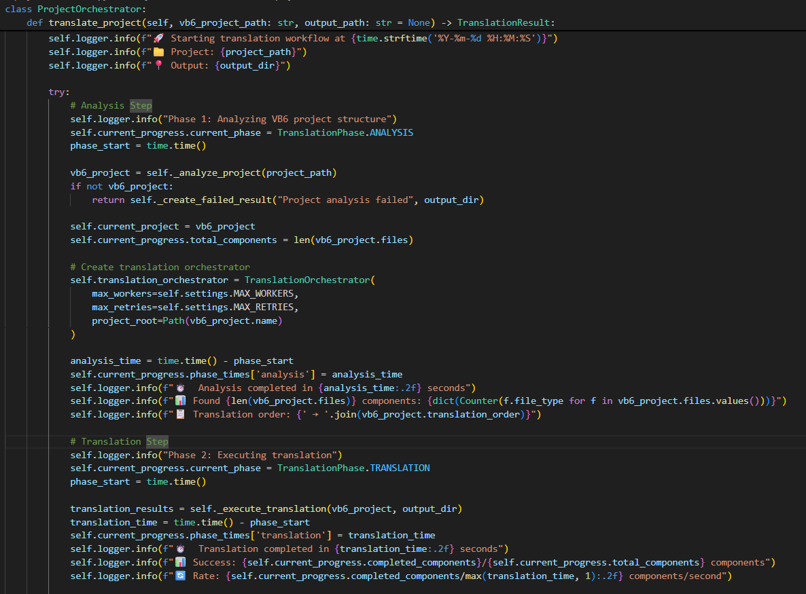

# 🔁 Legacy VB6 to C# Translation Pipeline

[](https://www.python.org/)
[](https://dotnet.microsoft.com/)
[]()
[]()
[](LICENSE)

An intelligent research-based pipeline for translating legacy **Visual Basic 6 (VB6)** applications into modern **C#/.NET** using Large Language Models, multi-agent orchestration, Retrieval-Augmented Generation and rule-based dependency mapping.

This project was developed as part of my MSc Computer Science major project at Anglia Ruskin University.

---

## 📌 Overview

Legacy enterprise systems often contain decades of business logic but are difficult to maintain, extend and integrate with modern platforms. This project explores how Large Language Models can support the migration of legacy VB6 applications into modern C#.

The pipeline analyses VB6 projects, identifies dependencies, routes different file types to specialised translation agents, retrieves relevant VB6-to-C# translation patterns, and generates structured C# output.

The project uses a hybrid approach:

- LLM-powered translation for language and code pattern conversion
- Multi-agent architecture for specialised translation tasks
- RAG for contextual VB6-to-C# translation examples
- Rule-based dependency mapping for namespace and reference resolution
- Compilation-error analysis for evaluation

---

## ❗ Problem

Many organisations still depend on legacy VB6 systems that are costly to maintain and difficult to modernise.

Common migration challenges include:

- VB6 forms and event-driven UI logic
- COM and ActiveX dependencies
- Global state and procedural modules
- ADODB database access patterns
- Namespace and dependency resolution
- Legacy syntax with no direct C# equivalent
- Large codebases that exceed normal LLM context limits
- Security concerns when sending proprietary code to cloud-based AI tools

A naive LLM translation approach often produces code that looks correct but fails to compile because of missing references, incorrect type mappings, namespace errors and incomplete architectural understanding.

---

## ✅ Solution

This project implements a hybrid translation pipeline that combines AI translation with deterministic analysis.

```text
VB6 Project
     |
     v
Project Analysis
     |
     v
Dependency Resolution
     |
     v
Multi-Agent Translation
     |
     v
RAG Pattern Retrieval
     |
     v
Rule-Based Namespace Mapping
     |
     v
C# / .NET Output
     |
     v
Compilation Error Evaluation
```

---

## 📈 Key Result

The pipeline achieved a significant improvement in translation quality during evaluation.

```text
Baseline compilation errors: 1,122
Final compilation errors:      142
Overall reduction:             87.3%
```

This showed that LLMs can support legacy code modernisation, but fully autonomous enterprise-scale migration still requires human review and deterministic engineering support.

---

## 🧠 Research Approach

The system was developed through five iterative phases:

| Phase | Approach | Outcome |
|------|----------|---------|
| Phase 1 | Baseline LLM translation | Established initial error count |
| Phase 2 | Larger code-specialised model | Improved language and type translation |
| Phase 3 | Multi-agent architecture | Improved form and business logic handling |
| Phase 4 | RAG integration | Improved translation of recurring VB6 patterns |
| Phase 5 | Rule-based dependency mapping | Major reduction in namespace and dependency errors |

---

## 🏗️ Architecture

The pipeline uses a modular architecture.

```text
Core/
├── analyzer.py
├── project_orchestrator.py
└── dependency_resolver.py

Translation/
└── Agents/
    ├── form_agent.py
    ├── business_logic_agent.py
    └── syntax_solver_and_optimization_agent.py

Knowledge/
├── rag_manager.py
└── VB6_to_CSharp_Equivalents/

Evaluation/
└── compilation_error_analysis.py

Data/
├── Input/
└── Output/
```

---

## 🤖 Translation Agents

The pipeline uses specialised agents for different VB6 file types.

| VB6 File Type | Agent | C# Output |
|--------------|-------|-----------|
| `.frm` | Form Agent | C# WinForms form and designer files |
| `.bas` | Business Logic Agent | Static C# classes |
| `.cls` | Business Logic Agent | C# classes |
| `.ctl` | Control handling logic | Custom control mappings |
| All files | Validation / optimisation logic | Cleaner C# output and error tracking |

---

## 🔍 Main Components

### 1. Project Analyzer

The analyzer reads the VB6 project structure and extracts:

- Forms
- Classes
- Standard modules
- User controls
- External references
- Dependencies
- Procedures and functions
- Variable declarations
- Event handlers

---

### 2. Dependency Resolver

The dependency resolver builds a dependency graph to determine a better translation order.

It helps reduce forward-reference problems and improves namespace mapping in the generated C# project.

---

### 3. Form Agent

The Form Agent translates VB6 `.frm` files into C# WinForms files.

It handles:

- VB6 form controls
- Event handlers
- Designer file generation
- Control mappings
- UI layout structure

Example mappings:

| VB6 Control | C# Equivalent |
|------------|---------------|
| TextBox | TextBox |
| Label | Label |
| CommandButton | Button |
| ListBox | ListBox |
| ComboBox | ComboBox |
| Frame | GroupBox |
| MSFlexGrid | DataGridView |
| CommonDialog | OpenFileDialog / SaveFileDialog |

---

### 4. Business Logic Agent

The Business Logic Agent translates `.bas` and `.cls` files into modern C#.

It handles:

- VB6 modules
- VB6 class modules
- Functions and subroutines
- Property Get / Let / Set patterns
- ADODB-style data access
- Error handling conversion
- Procedural-to-object-oriented restructuring

---

### 5. RAG Knowledge Base

The RAG system retrieves relevant VB6-to-C# examples before translation.

It uses pattern examples for:

- Forms
- Controls
- Event handlers
- Business logic
- ADODB database access
- Error handling
- Type conversion
- Syntax conversion

This helps reduce hallucination and improves consistency across translations.

---

### 6. Rule-Based Dependency Mapping

The rule-based component handles translation problems that LLMs struggled with, especially:

- Namespace resolution
- Missing references
- Inter-module dependencies
- Using statement generation
- Class and module reference mapping

This was one of the most important parts of the pipeline because dependency-related errors did not improve much from LLM prompting alone.

---

## 🧰 Tech Stack

### AI and LLM

- Qwen2.5-Coder
- Ollama
- Retrieval-Augmented Generation
- ChromaDB
- nomic-embed-text
- Prompt engineering
- Multi-agent orchestration

### Backend / Pipeline

- Python
- Regex-based static analysis
- Dependency graphs
- File parsing
- Code generation
- Error classification

### Target Platform

- C#
- .NET 8
- WinForms
- Visual Studio 2022

### Tools

- Git
- GitHub
- Visual Studio Code
- Visual Studio 2022
- Local LLM deployment

---

## 🧪 Evaluation

The project used compilation-error analysis as the main evaluation method.

This was necessary because enterprise-scale translated code often contains many interdependent modules, making full functional testing difficult before compilation issues are resolved.

Errors were grouped into categories such as:

- Language construct translation
- Namespace resolution failures
- Property access patterns
- Data type conversions
- Dependency issues
- Event handler mapping

---

## 📊 Results

| Phase | Compilation Errors | Improvement |
|------|--------------------|-------------|
| Phase 1: Baseline | 1,122 | Initial result |
| Phase 2: Enhanced model | 923 | 17.7% reduction |
| Phase 3: Multi-agent architecture | 746 | 19.2% further reduction |
| Phase 4: RAG integration | 487 | 34.7% further reduction |
| Phase 5: Rule-based dependency mapping | 142 | 70.8% further reduction |

Final result:

```text
Total error reduction: 87.3%
```

---

## 🖼️ Screenshots and Diagrams


### Overall System Architecture


---

### Multi-Agent Architecture


---

### Project Orchestrator Workflow




## 🚀 Installation

### Prerequisites

Make sure you have:

- Python 3.8+
- Git
- Ollama
- Visual Studio 2022
- .NET 8 SDK
- ChromaDB dependencies
- A local code-specialised LLM such as Qwen2.5-Coder

---

### 1. Clone the repository

```bash
git clone https://github.com/agyemyaws/legacyvb6codetocsharp.git
cd legacyvb6codetocsharp
```

---

### 2. Create and activate a virtual environment

```bash
python -m venv .venv
source .venv/bin/activate
```

On Windows:

```bash
.venv\Scripts\activate
```

---

### 3. Install dependencies

```bash
pip install -r requirements.txt
```

---

### 4. Install / run Ollama model

```bash
ollama pull qwen2.5-coder:14b
```

Or use another supported code-specialised model.

---

### 5. Configure environment variables

Create a `.env` file:

```env
DEFAULT_PROVIDER=ollama
OLLAMA_BASE_URL=http://localhost:11434
MODEL_NAME=qwen2.5-coder:14b
```

If using Claude or another external provider for non-confidential experiments:

```env
DEFAULT_PROVIDER=claude
CLAUDE_API_KEY=your_api_key_here
```

Do not commit your `.env` file to GitHub.

---

## 📖 Usage

### Basic translation

```bash
python main.py Data/Input/BMI/bmi.vbp
```

---

### Use a custom output directory

```bash
python main.py Data/Input/BMI/bmi.vbp --output-dir MyTranslatedProject
```

---

### Analyse a VB6 project first

```bash
python Core/analyzer.py Data/Input/BMI
```

---

### View RAG knowledge base statistics

```bash
python Knowledge/rag_manager.py --action stats
```

---

### Search translation patterns

```bash
python Knowledge/rag_manager.py --action search --query "VB6 code snippet here"
```

---

## 📁 Generated C# Project Structure

The pipeline generates a structured C# project.

```text
MyTranslatedProject/
├── MyTranslatedProject.sln
├── MyTranslatedProject.csproj
├── README.md
└── MyTranslatedProject/
    ├── FormName.cs
    ├── FormName.Designer.cs
    ├── ClassName.cs
    └── translation_summary.txt
```

---

## 🛠️ Building Translated Projects

```bash
cd MyTranslatedProject
dotnet restore
dotnet build
dotnet run
```

---

## 🔐 Security and Privacy

This project was designed with enterprise security considerations in mind.

For proprietary codebases, local LLM deployment is preferred because it avoids sending sensitive source code to external cloud APIs.

The research used local model hosting through Ollama to support data privacy and confidentiality requirements.

---

## ⚠️ Limitations

This project does not claim fully autonomous enterprise migration.

Current limitations include:

- Manual review is still required
- Some semantic errors may remain even after compilation improvement
- Complex COM/ActiveX components may need redesign
- Full functional testing was limited by compilation issues
- Some legacy patterns require deterministic rules rather than LLM output
- Cloud-based models may perform better but can create confidentiality risks

---

## 🔮 What I Would Improve Next

Future improvements include:

- Implement a stronger compiler-feedback correction loop
- Add a dedicated syntax repair agent
- Add automated unit test generation for translated C# code
- Improve semantic equivalence validation
- Support Fortran-to-C# translation for mixed legacy systems
- Add CI/CD for translation and validation workflows
- Improve handling of COM and ActiveX dependencies
- Add a web interface for uploading and translating VB6 projects
- Export detailed translation quality reports
- Add support for WPF or modern .NET UI frameworks

---

## 📄 License

This project is licensed under the MIT License. See the [LICENSE](LICENSE) file for details.

---

## ⭐ Support

If you find this project useful, feel free to star the repository.
